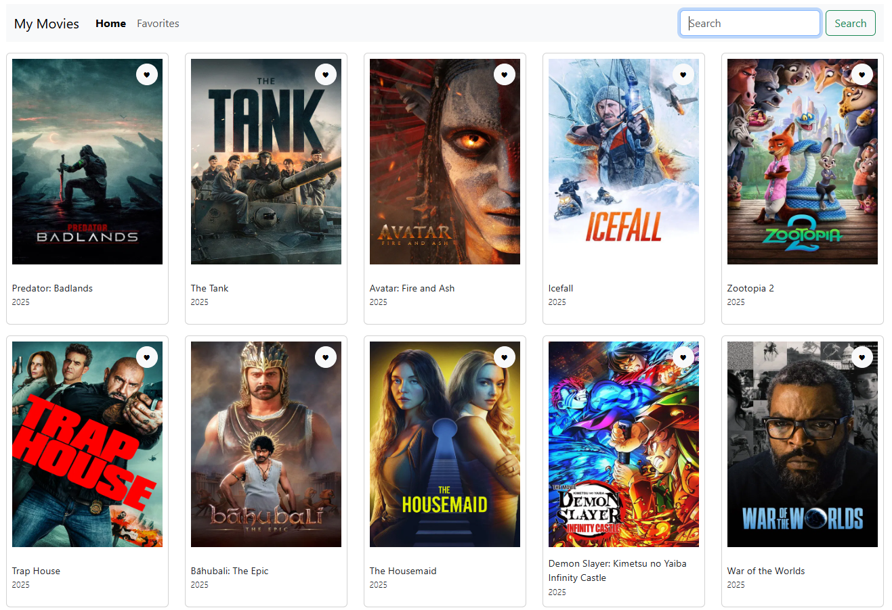
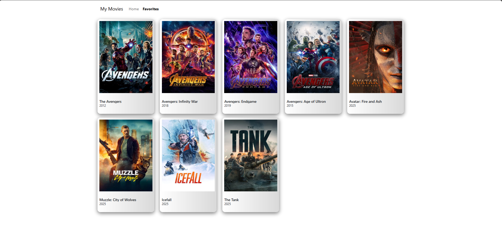

# My Movies 🎬

A React & TypeScript web app to **browse, search, and favorite movies** using the TMDb API.

Users can view popular movies, search for their favorites, and save movies locally with persistent favorites using `localStorage`.

---

## 🔹 Features

- Browse **popular movies** on page load
- **Search movies** by title using TMDb API
- **Add/remove favorites** with heart button
- Favorites persist across reloads using `localStorage`
- Responsive UI using **Bootstrap 5**
- Clean routing with **React Router v6**
- Friendly 404 page with **Go Home** functionality

---

## 🛠️ Tech Stack

- **React** (v18+)
- **TypeScript**
- **React Router DOM**
- **Bootstrap 5**
- **TMDb API**
- **Vite** (for development)

---

## 📸 Screenshots

  
_Browse popular movies and search_

  
_Saved favorites_
